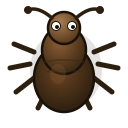
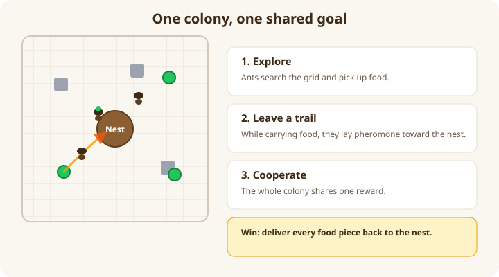
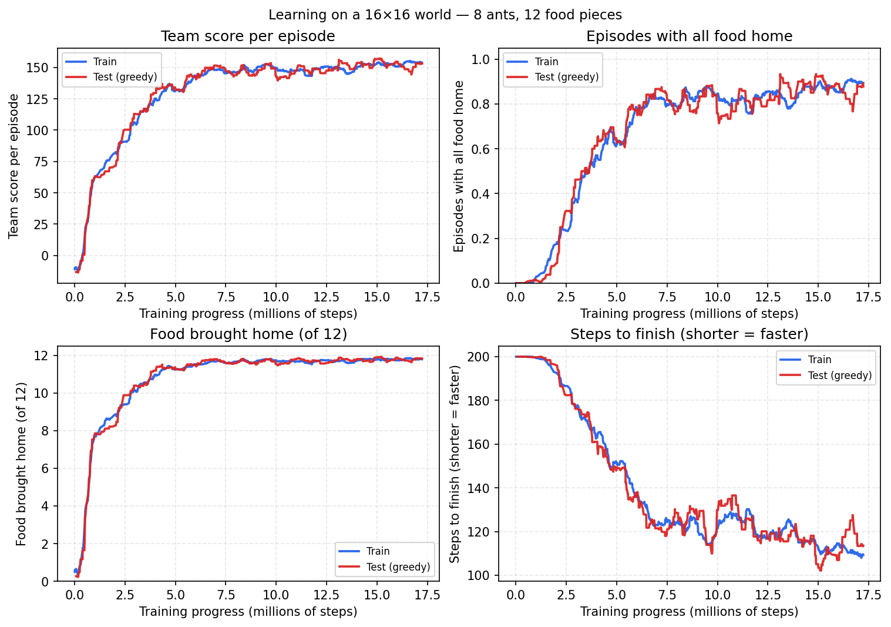
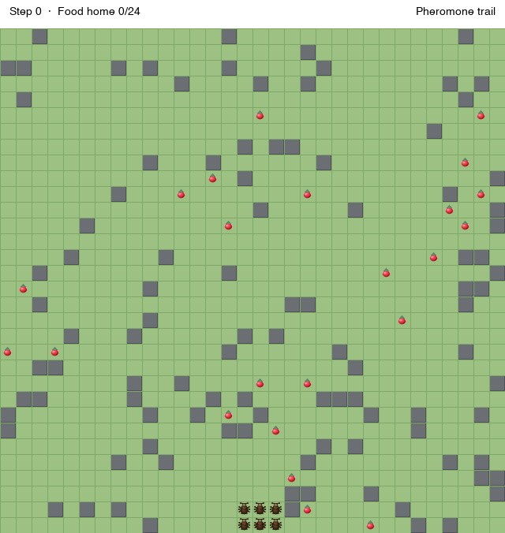

<p align="center">
  
</p>

<h1 align="center">Ant Colony Foraging</h1>

<p align="center">
  Teach a swarm of ants to find food, find their way home, and leave trails for each other — using multi-agent reinforcement learning.
</p>

<p align="center">
  <a href="#the-idea">The idea</a> ·
  <a href="#observations-actions-rewards">Obs &amp; rewards</a> ·
  <a href="#what-weve-seen-so-far">Results</a> ·
  <a href="#quick-start">Quick start</a>
</p>

---

## The idea

A colony of ants lives on a small grid. Food appears in random places. The nest sits in the middle. Ants can move, pick up food, and **leave pheromone** when they carry food home — so others can follow successful paths.

Everyone on the team gets the **same reward**: the colony wins when **all food is back at the nest**.

<p align="center">
  
</p>

Learning is done with **MAPPO** (many ants learning together) on top of [EPyMARL](https://github.com/uoe-agents/epymarl).

---

## Observations, actions, rewards

Each ant only gets what a real ant could sense on the ground — no satellite view of the whole map. Pickup, pheromone drops, and nest delivery are **automatic** when an ant moves onto the right cell (not separate actions).

### Observations (30 numbers per ant)

Real ants don’t have GPS. They combine **what they see nearby** with an **internal sense of where home is**, built from their own movement (path integration — like keeping a running estimate of “how far and which way I’ve walked from the nest”). This environment mirrors that:

| Part | Real-world idea | In the simulation |
|------|-----------------|-------------------|
| **27 values** | Short-range sensing (touch, smell, nearby landmarks) | **3×3** patch: **wall**, **food**, **pheromone** per cell |
| **1 value** | Knowing you’re carrying something | **Carrying food** (0 or 1) |
| **2 values** | Internal “compass + odometer” back to the nest — no global coordinates | **Direction home**: a vector that starts pointing toward the nest at spawn and **updates each step** as the ant moves (path integration, not GPS) |

So an ant can find its way home after wandering because it **remembers the route in its body**, the same way desert ants use step-counting and turning cues — not because something tells it “you are at (x, y) on the grid.”

Pheromone works like real trail chemistry: laid automatically while carrying food, fading by **×0.95** each step so old trails die out. **10%** of cells are random walls, fixed for the episode.

### Actions (5 discrete)

| ID | Action |
|----|--------|
| 0 | Stay |
| 1 | Move up |
| 2 | Move down |
| 3 | Move left |
| 4 | Move right |

Walls block movement. Stepping on food **picks it up**; stepping on the nest while carrying **delivers** it.

### Rewards (one shared team score per step)

All ants get the **same** reward each step (cooperative MARL):

| Event | 16×16 (baseline) | 32×32 (scaled) |
|-------|------------------:|-----------------:|
| Food delivered to the nest | **+10** per piece | **+20** (× food ratio) |
| Time (every step) | **−0.08** team total | **−0.08** team total |
| All food delivered (episode success) | **+50** bonus | **+100** (× food ratio) |

Rewards **scale with `n_food`** (delivery + win bonus). The per-ant step rate is adjusted so **32 ants** do not pay 4× the step tax each tick — same idea as scaling `t_max` with map size. Values are computed in `antcolony.config.scaled_rewards`. Baselines, all W&B runs, and reward tables → **[docs/REWARDS.md](docs/REWARDS.md)**.

---

## What we've seen so far

Tracked on [Weights & Biases](https://wandb.ai/aid26006-university-of-macedonia/ant-colony-foraging). **Baselines to beat** (greedy test eval) are in **[docs/REWARDS.md](docs/REWARDS.md)**.

**Baseline** = best test success during training (`models/…/best/`), not the last W&B log (runs were interrupted before a planned stop).

| Map | Best run | Peak test success | @ `t_env` |
|-----|----------|------------------:|----------:|
| **16×16** | [rich-armadillo-3](https://wandb.ai/aid26006-university-of-macedonia/ant-colony-foraging/runs/x11wd1h0) | **~90%** | ~17.2M |
| **32×32** | [playful-cosmos-10](https://wandb.ai/aid26006-university-of-macedonia/ant-colony-foraging/runs/pnle4do2) | **87.5%** | **21.2M** |

**Full success** = all spawned food **delivered to the nest** (`battle_won`), not just an empty map — food can still be on ants when time runs out.

### Best **16×16** — rich-armadillo-3

Eight ants, twelve food pieces, a compact map — our first run where the swarm clearly **learned the job**.

| What we measured | In plain terms |
|------------------|----------------|
| **Food home** | Almost every episode: **~12 of 12** pieces delivered |
| **Full success (test)** | **90%** of greedy-eval episodes end with the nest stocked |
| **Speed** | Episodes shrink from ~200 steps down to **~110** |
| **Team score** | Test return **~155** (unscaled rewards) |

<p align="center">
  
</p>

*How learning looked over time on the 16×16 world (logged during training).*

**Takeaway:** the colony goes from random wandering to **organized foraging** — higher scores, more food delivered, shorter episodes.

<details>
<summary><strong>Run setup (16×16)</strong></summary>

- Grid **16×16**, **8** ants, **12** food, **200** steps per episode  
- **MAPPO**, cooperative team reward, **`t_max` ~20M**, trained on GPU  
- W&B: **rich-armadillo-3** (`x11wd1h0`), peak ~17.2M `t_env`

</details>

### Best **32×32** — playful-cosmos-10 (scaled rewards)

Larger map (32×32, 32 ants, 24 food). Training budget **`t_max: 40_000_000`** env steps; checkpoints every **1M** steps plus **`best/`** when **`test_battle_won_mean`** improves.

| What we measured | In plain terms |
|------------------|----------------|
| **Full success (test, peak)** | **87.5%** @ **21.2M** `t_env` (`best/` checkpoint) |
| **Demo episode** | Greedy eval, seed 180 — full win in **338** steps |

Strong foraging on 16×16 showed up around **4–5M** `t_env`; 32×32 best test success peaked around **21M**. An earlier 32×32 run without scaled rewards (**zesty-firefly-8**) plateaued around **~70%** train / **31%** test.

<p align="center">
  
</p>

*Demo: **`best/`** checkpoint @ 21.2M (**87.5%** peak test success). Greedy eval, seed 180, full win in 338 steps. Red berries = food, yellow = pheromone trail, nest at the bottom.*

<details>
<summary><strong>Run setup (32×32)</strong></summary>

- Grid **32×32**, **32** ants, **24** food, **800** steps per episode  
- Scaled rewards (+20 delivery, −0.08 team step, +100 win) — see [docs/REWARDS.md](docs/REWARDS.md)  
- W&B: **playful-cosmos-10** (`pnle4do2`), peak @ **21.2M** `t_env` (run interrupted later; no planned stop)

</details>

---

## Quick start

```bash
git clone https://github.com/stanimeros/ant-colony-epymarl.git
cd ant-colony-epymarl
chmod +x setup.sh train.sh
./setup.sh
./train.sh
```

Training runs in the **background** — safe to disconnect SSH. Watch progress:

```bash
tail -f logs/train-*.log
```

To **stop** training without deleting checkpoints or W&B history, kill the `main.py` processes only — do **not** run `./setup.sh` (it clears `epymarl/results/` by default). See [docs/REWARDS.md](docs/REWARDS.md#starting-a-new-experiment).

---

## Credits

- **Ant environment** — this repository  
- **Training framework** — [EPyMARL](https://github.com/uoe-agents/epymarl) (Apache 2.0), installed by `setup.sh`
